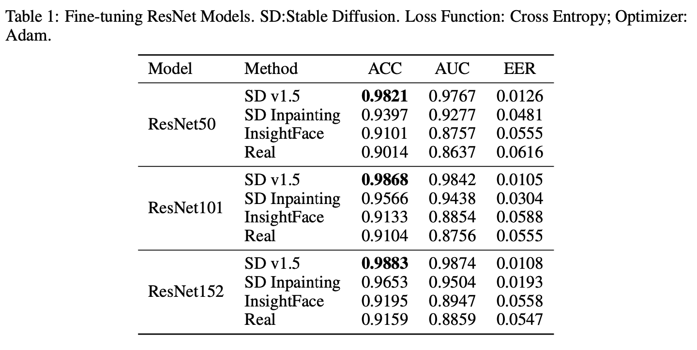
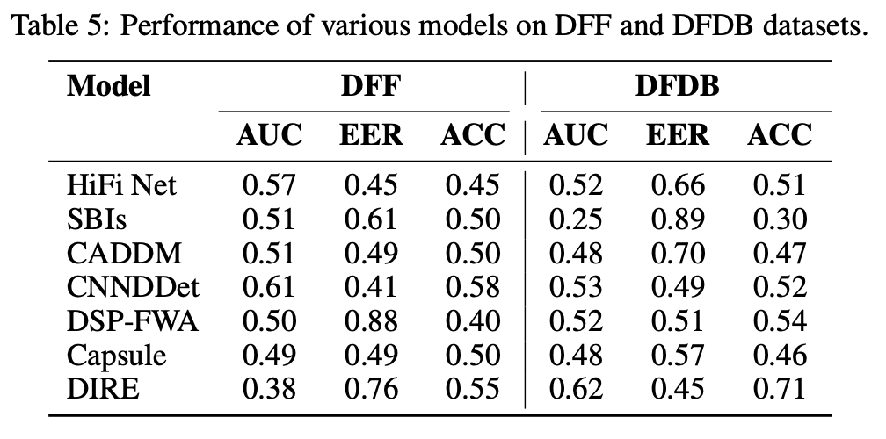
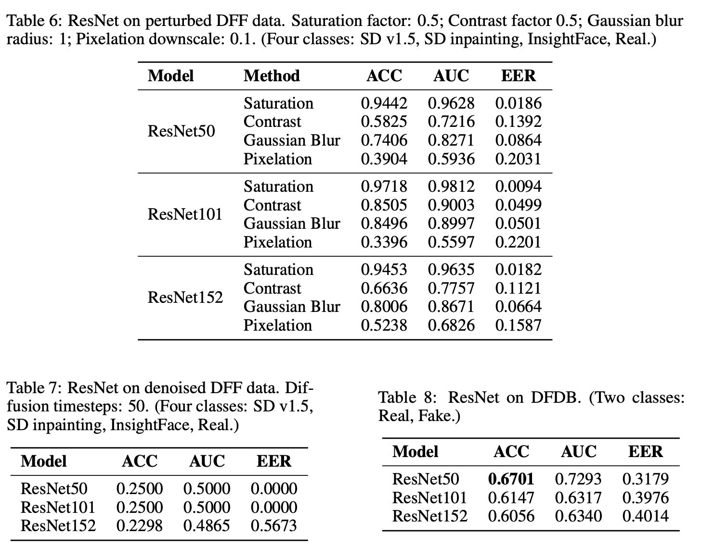
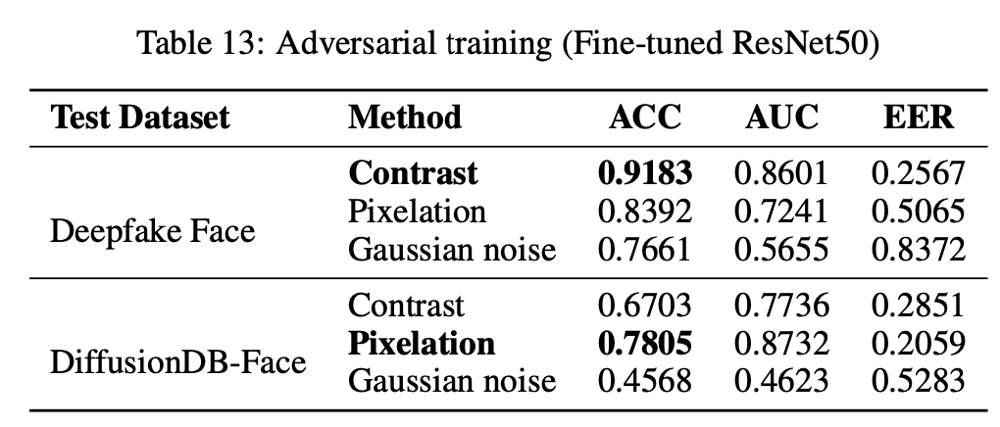

# Introduction
To learn and investigate about the DeepFake issue, we try to finetune different ML models on the [DeepFakeFace](https://github.com/OpenRL-Lab/DeepFakeFace) and the [DiffusionDB](https://github.com/poloclub/diffusiondb) dataset.

Note: This repo contains the partial source code for the final project of the course Neural Networks and Machine Learning. Please check out the [final_report.pdf](https://github.com/ChenLeah/deepfakeface_test/blob/master/Final_report.pdf) for the full result.

## Folders
- Llama_code: data preprocessing code for Llama3.2 (WIP)
- ResNet_code: all code related to the ResNet model
- results: some result and evaluation images
- submit: all .sh files for runing the code on NSCC server for GPU 

# Related content in the report
##  3 Fine-tuning Models
We fine-tuned multiple state-of-the-art models for image classification using the DeepFakeFace (DFF) dataset, which includes both real and diffusion-generated deepfake images. The evaluation metrics includes: **Accuracy (ACC)**, **Area Under the Curve (AUC)**, and the **Equal Error Rate (EER)**.

### 3.1 ResNet
ResNet, a classic CNN architecture, is known for its efficient parameter utilization and strong performance on image classification tasks. We fine-tuned ResNet50, ResNet101, and ResNet152 models to detect deepfakes in the DFF dataset. Overfitting was a key challenge, requiring careful tuning of the learning rate. A learning rate of 1 × 10−5 was selected to balance convergence and generalization.

Table 1 summarizes the results, showing high accuracy for images generated by Stable Diffusion v1.5, which achieved the best classification performance. Overall accuracy across the dataset reached 90.22%.

...

## 4 Generalization

To evaluate the generalizability of each fine-tuned model, we tested them on the DiffusionDB-Face (DFDB) dataset. Benchmarks for the DFDB dataset, as reported in the original study, are presented in Table 5:

### 4.1 Model Robustness: ResNet
In real-world scenarios, images are often subjected to noise from compression, filters, or other distortions. Robustness to such perturbations is crucial for reducing false positives in deepfake detection. To evaluate the robustness of ResNet models, we introduced various perturbations to the input images, including saturation, contrast, Gaussian blur, and pixelation. Among these, contrast and pixelation had the most significant impact on classification performance, as detailed in Table 6. Saturation had a smaller effect, likely because some input images were already highly saturated.

Additionally, adversarial examples have been shown to bypass detection by denoising fake images using diffusion models. To explore this vulnerability, we reconstructed all input images using a diffusion model and observed a substantial drop in accuracy, as shown in Table 7. These results suggest that ResNet models tend to learn features specific to each generator rather than generalizable patterns indicative of manipulated content.
Generalization remains a significant challenge for CNN-based models, as also noted by Luo et al. . To further assess this, we evaluated ResNet models on the DFDB dataset. As shown in Table 8, the accuracy dropped to approximately 60%, with ResNet50 achieving the highest performance at 67.01%.

...

### 4.5  Adversarial Training for Improved Generalization
The generalization challenges observed in CNN-based models, such as ResNet and EfficientNet, align with findings in Section 2, highlighting their susceptibility to overfitting and limited ability to integrate global features for robust detection. To mitigate these issues, we conducted adversarial training on ResNet50, which demonstrated the highest accuracy on the DiffusionDB-Face (DFDB) dataset among the tested ResNet models.

To improve the model’s robustness, we introduced perturbations, including contrast adjustments, pixelation, and Gaussian noise. Gaussian noise was selected due to its relevance to diffusion models. As shown in Table 13, adversarial training with pixelation significantly enhanced the model’s performance on unseen data. Although pixelation reduced the model’s accuracy on the DeepFakeFace (DFF) dataset from 90.22% to 83.98%, it increased accuracy on the DFDB dataset from 67.01% to 78.05%, demonstrating improved generalization.

However, combining both contrast adjustments and pixelation in a single training pipeline did not yield further improvements. The accuracy on the DFF dataset decreased slightly to 83.90%, and the accuracy on the DFDB dataset dropped to 73.79%, falling short of the gains achieved with pixelation alone. This suggests that while adversarial training with individual perturbations like pixelation can enhance robustness, combining multiple perturbations may introduce competing effects that hinder overall performance.

